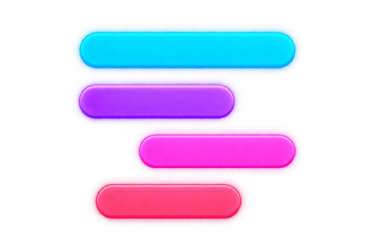
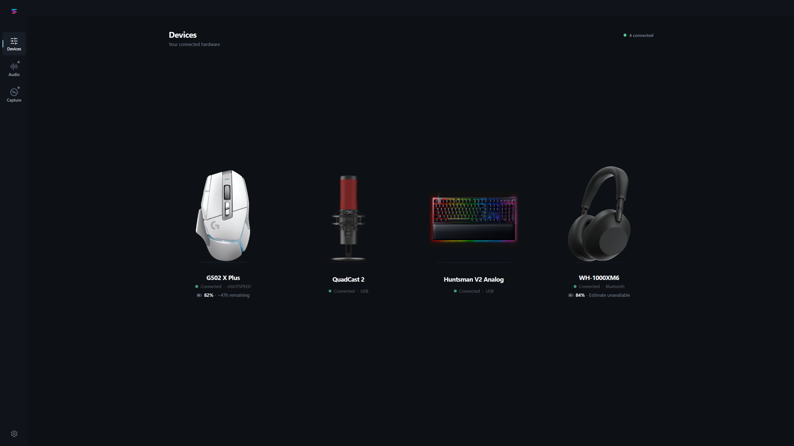

<p align="center">
  
</p>

<h1 align="center">Switchboard</h1>

<p align="center">
  A low-overhead Windows control surface for peripherals, audio routing, microphone processing, and game capture.
</p>

<p align="center">
  <a href="ARCHITECTURE.md">Architecture</a> ·
  <a href="DESIGN.md">Design</a> ·
  <a href="PERFORMANCE.md">Performance</a> ·
  <a href="TODO.md">Current work</a> ·
  <a href="https://github.com/IEver3st/switchboard/issues">Issues</a>
</p>



Switchboard brings device control, audio mixing, microphone processing, replay capture, and clip management into one restrained desktop utility. It is built to replace the parts of peripheral suites people actually use without keeping a pile of vendor applications, background services, and decorative dashboards alive.

This repository is an active Windows alpha. The control plane is real, several named devices have hardware-backed integrations, and the native audio and capture hosts are working. Some release-critical paths still need signed drivers, powered-on hardware acceptance, and long-running validation. Switchboard labels those boundaries instead of pretending they are finished.

## What works today

### Devices

- **Logitech G502 X Plus:** direct HID++ control for DPI stages, shift DPI, report rate, primary button assignments, onboard mode, battery state, supported LIGHTSYNC effects, and addressable zones. Onboard profile writes require a known layout and valid CRC.
- **HyperX QuadCast 2:** event-driven mute state, maintained lighting, brightness, pulse timing, and hardware-backed lighting profiles.
- **Razer Huntsman V2 Analog:** readback-backed brightness, firmware-reported quick effects, Gaming Mode, and onboard profile selection. Actuation, analog mapping, macros, Snap Tap, and per-key lighting remain outside Switchboard until their device protocols are independently verified.

Switchboard shows a control only when the detected device reports a matching capability. Failed writes leave the last confirmed state intact.

### Audio

- Native .NET 10 audio host built on NAudio.
- Physical microphone capture with 48 kHz normalization, microphone DSP, monitoring, and real meters.
- CPU noise suppression through a packaged RNNoise implementation.
- Game, Chat, Media, Aux, Microphone, Personal, Stream, and Clip mix contracts.
- ChatMix, per-channel processing, parametric EQ, presets, session discovery, and output selection.
- Per-process endpoint assignment with immediate readback and a pending-restart state when Windows retains an existing session.

The complete virtual-channel path depends on the signed WDM transport driver in `drivers/virtual-audio`. Until Windows accepts and loads every required endpoint, Switchboard keeps virtual routing unavailable.

### Capture

- Isolated .NET capture host with an FFmpeg-first Windows path.
- Bounded encoded segment ring, atomic replay saves, and MP4 remux without a full re-encode.
- Automatic game detection plus manual executable entries.
- Searchable clip library, favorites, filters, grid and list views, trim editing, and waveform inspection.
- Ordered multi-clip montage projects with trim, reorder, playback, and FFmpeg export.

The development host defaults to simulation. Production capture claims require the Windows FFmpeg path and real encoder output, not renderer fixtures.

### Desktop lifecycle

- Sandboxed Electron renderer with no Node access.
- Narrow, typed preload operations and Zod-validated mutable IPC.
- Electron-main-owned persistence for modules, devices, audio, capture, settings, diagnostics, and engine state.
- Optional native hosts that exist only while their engines are enabled.
- Tray lifecycle with optional renderer destruction.
- GitHub Release update checks, optional background downloads, explicit restart, and install-on-next-startup policy for installed Windows builds.
- In-app bug and feature handoff that prepares a redacted report, copies it, and opens this repository's issue flow.

## Project status

| Area | Current state |
| --- | --- |
| Electron control plane | Implemented and persisted |
| G502 X Plus and QuadCast 2 | Hardware-backed integration |
| Huntsman V2 Analog | Supported controls implemented; clean-process physical revalidation remains |
| Audio host | Native host implemented |
| Virtual audio endpoints | Package builds; production signature and qualification remain |
| Capture host | Native path implemented; production Windows capture qualification remains |
| Application updates | Client flow implemented; no public release has been published yet |
| Windows installer | Buildable; currently unsigned |
| Soak testing | Release suite remains |

The exact remaining work lives in [TODO.md](TODO.md). Performance budgets and soak requirements live in [PERFORMANCE.md](PERFORMANCE.md).

## Architecture

```text
Sandboxed React renderer
          │
          │ narrow typed IPC
          ▼
Electron main process
  ├── canonical state and persistence
  ├── device registry and vendor modules
  ├── Audio.Host            .NET 10 + NAudio + native DSP
  ├── Capture.Host          .NET 10 + FFmpeg
          │
          ▼
Signed virtual audio transport driver  C++ / WDK
```

Realtime audio and video buffers never cross Electron IPC. Electron owns policy and state; isolated native hosts own realtime work. The virtual driver transports frames only. It contains no DSP, profiles, networking, update logic, or product policy.

Read [ARCHITECTURE.md](ARCHITECTURE.md) for subsystem boundaries and state ownership.

## Run Switchboard

Development currently targets Windows. Install [Bun](https://bun.sh/) and the .NET 10 SDK, then run:

```powershell
bun install
bun run dev
```

Build the Electron application:

```powershell
bun run build
```

Build the native hosts and create an NSIS installer:

```powershell
bun run dist:win
```

The generated installer is not Authenticode-signed unless the release environment supplies signing credentials.

## Validate a checkout

```powershell
bun run check
bun run check:source
bun run check:types
bun run test
bun run build
dotnet build .\engines\capture-host\Capture.Host.csproj
dotnet build .\engines\audio-host\Audio.Host.csproj
```

The repository has no lint script. The checks above cover structural invariants, source transpilation, TypeScript contracts, Bun tests, native host tests, Electron bundles, and direct host builds.

Hardware fixtures and native Electron captures prove deterministic application behavior. They do not prove a physical HID or Bluetooth write, visible lighting, production audio routing, encoder output, reconnect behavior, or a 24-hour soak. Each subsystem document records its remaining physical proof.

## Browser preview

The browser preview is useful for reviewing the shell without Electron or hardware:

```powershell
bun run preview:static
```

Open `preview/index.html`, or use the generated single-file `preview/standalone.html`. The standalone file is generated and should not be edited by hand.

## Repository map

| Path | Purpose |
| --- | --- |
| `src/shared/contracts.ts` | Canonical renderer, main, preload, and host contracts |
| `src/main/controller.ts` | Product orchestration and persisted state transitions |
| `src/main/services/device-registry.ts` and `src/main/modules` | Device registry and vendor protocol modules |
| `src/renderer/src` | React desktop interface |
| `engines/audio-host` | Realtime Windows audio host |
| `engines/capture-host` | FFmpeg-first Windows capture host |
| `native/noise-bridge` | Packaged CPU noise-suppression bridge |
| `drivers/virtual-audio` | Transport-only WDM driver source and release contract |
| `docs` | Subsystem, release, and supply-chain notes |
| `scripts` | Build, validation, measurement, and native review tools |

## Reporting bugs

Use Switchboard's **Bug or feature** action, or open a [GitHub issue](https://github.com/IEver3st/switchboard/issues/new). Review the report before submitting it because issues in this repository are public.

The app can confirm that it copied a report and opened GitHub. It cannot claim that GitHub accepted the issue until you submit it in the browser. Diagnostics are limited to the app version, Electron runtime, operating system, and architecture.

## License

No project license has been selected yet. Public access to this repository does not grant permission to copy, modify, or redistribute Switchboard. Third-party components retain their own licenses and attributions in [THIRD_PARTY_NOTICES.md](THIRD_PARTY_NOTICES.md).
