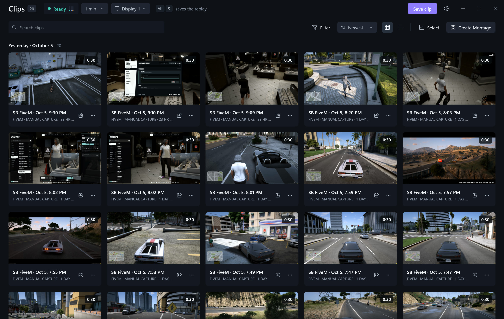
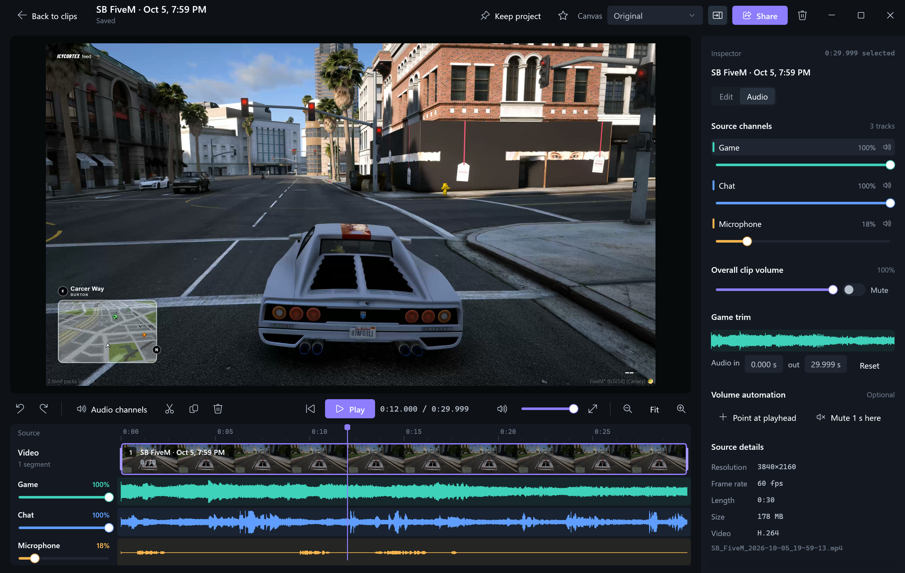
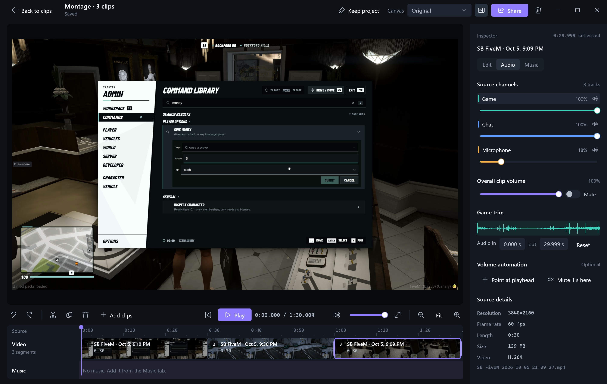
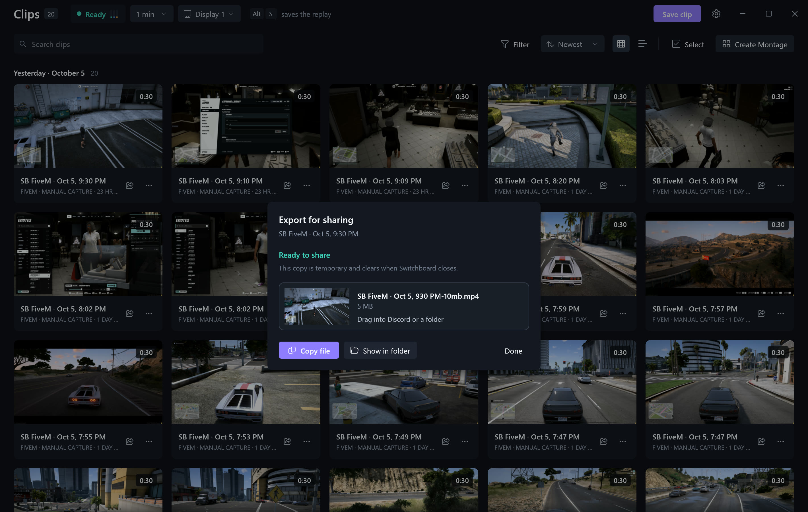
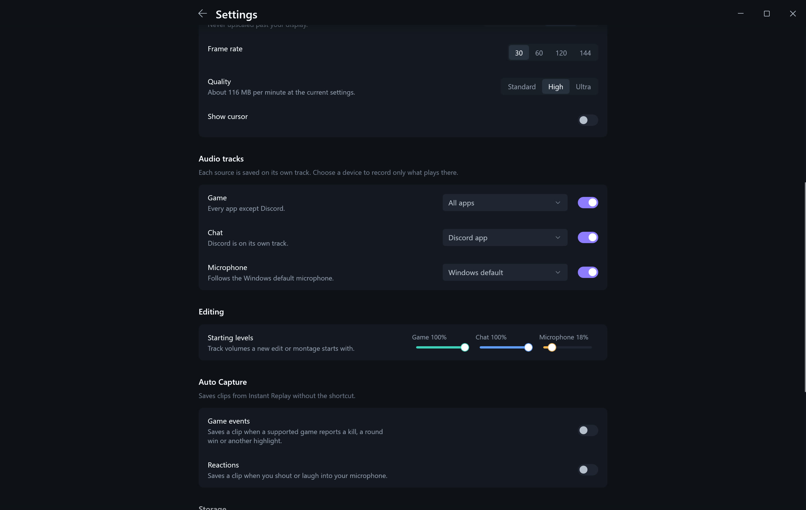

<p align="center">
  
</p>

<h1 align="center">Switchboard</h1>

<p align="center">
  A low-overhead clipping app for Windows.
</p>

<p align="center">
  <a href="https://github.com/IEver3st/switchboard/releases?q=native-v&expanded=true">Download</a> ·
  <a href="switchboard-rs/README.md">Technical notes</a> ·
  <a href="https://github.com/IEver3st/switchboard/issues">Issues</a>
</p>



Switchboard keeps the last few minutes of your game ready to save. Press the shortcut and the clip is on disk in a fraction of a second, with game audio, voice chat and your microphone on separate tracks so you can balance them afterwards. Trim it, mix it, put several clips into a montage, and export a copy small enough to drop straight into Discord.

It is one small native program written in Rust. There is no browser engine, no background helper suite and no FFmpeg process running while you play.

## Features

### Instant Replay

- Keeps the last 15 seconds to 10 minutes, encoded on your graphics card with its hardware H.264 encoder.
- Game, Chat and Microphone are recorded on separate audio tracks. Game is every app except Discord, Chat is Discord, and each can instead follow a specific output device (useful with SteelSeries Sonar or similar mixers).
- A global shortcut saves the clip, and a small notice confirms it without taking focus from your game.
- Up to 4K at 30, 60, 120 or 144 fps, with Standard, High and Ultra quality.

### Clip library

- Clips grouped by day with thumbnails, length, game and how long ago they were saved.
- Search, filters (favorites, game, Auto Capture or manual, events, date), six sort orders, and grid or list view.
- Rename, favorite, play, show in folder, or move to the Recycle Bin. Multi-select works with Ctrl and Shift.

### Editor



- Trim, split, duplicate and reorder on a timeline with a filmstrip and a waveform for every track.
- Per-track levels, mutes, trims and volume automation, plus overall clip volume.
- Framing for vertical and square canvases (9:16, 1:1, 4:5, 16:9), speed changes, freeze frames, text, blur and pixelate overlays, and picture adjustments.
- Every change autosaves as a draft. Drafts clear three hours after their last save unless you keep them, and a discarded draft can be brought back with Undo.

### Montages



- Select clips in the library and create a montage, or add more clips from the editor.
- Each clip keeps its own trims and levels. Add a music track with ducking under voice.

### Share



- Export at 10, 25 or 50 MB, or at original quality. The 10 MB preset fits Discord's free upload limit.
- Drag the finished file straight into Discord or a folder, or copy it and paste it anywhere.
- Montages export at a size you choose and save where you pick.

### Auto Capture

- Saves a clip when a supported game reports a kill, a round win or another highlight. Counter-Strike 2 is supported through its game state integration; War Thunder is experimental.
- Reactions: saves a clip when you shout or laugh into your microphone, with adjustable sensitivity and cooldown.
- New Auto Capture clips are flagged in the library until you look at them.

### Settings



Everything is on one page: replay length and shortcut, display, resolution, frame rate and quality, which device each audio track records, the levels new edits start with, Auto Capture, the clips folder, updates and start with Windows.

## Resource use

Measured on an AMD RX 9070 XT with a Ryzen 9 9950X3D and a 4K display.

| | Switchboard 1.0 | Switchboard 0.9 (Electron) |
| --- | ---: | ---: |
| Replay running, 1440p60, three audio tracks, window closed | about 180 MB in one process | about 1,550 MB across Electron, the capture host and FFmpeg |
| Tray only, replay off | about 3 MB | |
| Window open on the clip library | about 60 MB at 4K, under 20 MB at 1420 x 900 | |
| Saving a clip | 30 to 110 ms | |

The window is a separate process that exits when you close it, so a closed window costs nothing. Video decoding for the editor runs in a short-lived helper that exits when the editor closes, which gives its memory back to Windows.

## Install

1. Download `switchboard-native-<version>.exe` from the [latest native release](https://github.com/IEver3st/switchboard/releases?q=native-v&expanded=true).
2. Put it in a folder of your choice and run it. Switchboard opens its window and adds a tray icon, with Instant Replay already running. Closing the window keeps it recording in the tray.
3. Press **Ctrl+Shift+F10** to save a clip, or pick your own shortcut in Settings.

Clips go to `Videos\Switchboard\Clips` by default. Settings live in `%LOCALAPPDATA%\Switchboard Native`.

The executable is not code-signed yet, so Windows SmartScreen may warn the first time you run it.

### Requirements

- Windows 10 version 2004 or later, or Windows 11. Separate Game and Chat tracks rely on per-process audio capture, which needs 2004 or later.
- A graphics card with a hardware H.264 encoder. Media Foundation picks NVIDIA, AMD or Intel; only AMD has been tested so far.
- [FFmpeg](https://ffmpeg.org/download.html) for exporting and sharing, either on your `PATH` or next to the Switchboard executable. Recording, saving and editing do not need it.

### Updates

Switchboard checks GitHub for a new version shortly after it starts and then every hour. A new version downloads in the background, is checked against its published SHA-256 checksum, and installs the next time Switchboard starts, or right away from **Settings > Updates > Restart to update**. It never restarts in the middle of a session. You can turn automatic updates off in Settings.

### Coming from Switchboard 0.9

The 0.9 app updates itself to this version through its normal update check. The new version installs to `%LOCALAPPDATA%\Programs\Switchboard Native`, keeps your clips folder, shortcut, replay length, start with Windows and Auto Capture settings, carries over favorites and renamed clips, then removes the old app. It appears in **Settings > Apps** as Switchboard and can be uninstalled from there; your clips and settings stay.

## Build from source

Install [Rust](https://rustup.rs/) (stable), then:

```powershell
cd switchboard-rs
cargo build --release
cargo test --release
.\target\release\switchboard-rs.exe
```

Every push to `main` that changes `switchboard-rs/` builds, tests and publishes the next patch release (`native-v<version>`) through [`.github/workflows/native-release.yml`](.github/workflows/native-release.yml). To start a new minor or major version, set `version` in `switchboard-rs/Cargo.toml`.

[switchboard-rs/README.md](switchboard-rs/README.md) covers the capture pipeline, process layout and test tooling.

## Repository

| Path | What it is |
| --- | --- |
| `switchboard-rs/crates/capture` | Screen and audio capture, the replay buffer and the MP4 writer |
| `switchboard-rs/crates/app` | The tray service, the window and the updater |
| `switchboard-rs/crates/media` | Playback, frames and waveforms for the editor |
| `switchboard-rs/crates/project` | Clip edits and montages |
| `switchboard-rs/crates/export` | FFmpeg export for sharing |
| `switchboard-rs/crates/autocapture` | Game events and reaction clipping |

The rest of the repository holds the 0.9 Electron app, which Switchboard 1.0 replaces.

## Known limits

- Display capture only, no single-window capture yet.
- Tested on AMD graphics. NVIDIA and Intel encoders, HDR displays and multi-GPU laptops are not verified yet.
- The window has no screen-reader support yet.

## Reporting bugs

Open a [GitHub issue](https://github.com/IEver3st/switchboard/issues/new). Issues in this repository are public, so leave out anything private.

## License

No license has been chosen yet. Public access to this repository does not grant permission to copy, modify or redistribute Switchboard. Third-party components keep their own licenses; see [THIRD_PARTY_NOTICES.md](THIRD_PARTY_NOTICES.md).
